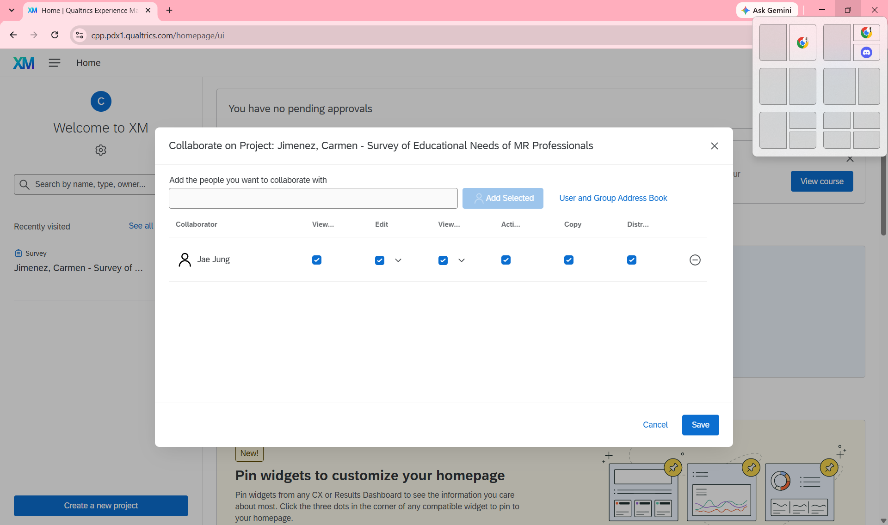
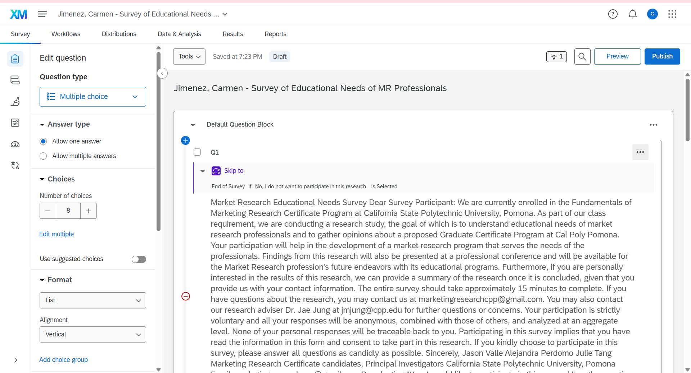
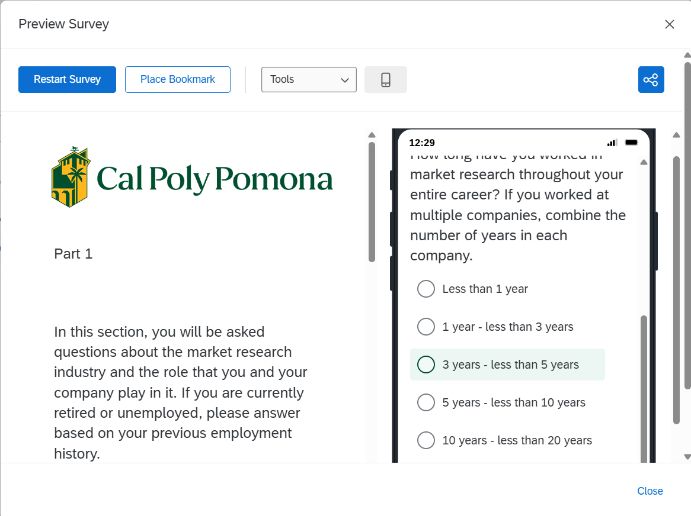
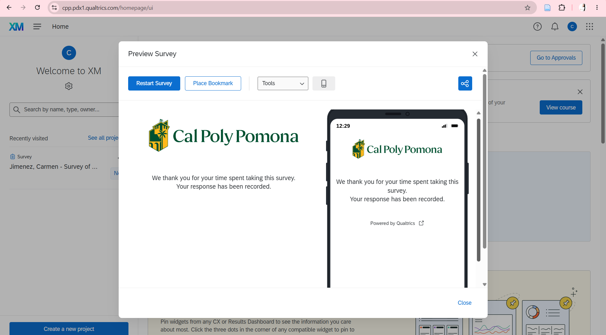

# Survey Overview

This report documents the rough draft of the Qualtrics survey titled **Jimenez, Carmen - Survey of Educational Needs of MR Professionals**. The survey remains in Draft status and was not activated or distributed.

# Collaboration Evidence

The Qualtrics project was shared with Dr. Jae Jung (`jmjung`) with all available collaboration permissions enabled.

{width="100%"}

# Beginning of Survey

The beginning of the survey contains the research information and consent question. Respondents who select that they do not wish to participate are directed to the end of the survey.

{width="100%"}

# Middle of Survey

The middle portion introduces Part 1 and asks respondents about their market research experience.

{width="100%"}

# End of Survey

The survey ends with a confirmation message indicating that the response has been recorded.

{width="100%"}

# Appendix

- [GitHub Repository](https://github.com/carmenjimenez97/Jimenez-Carmen-Qualtrics-Survey)
- [GitHub Pages](https://carmenjimenez97.github.io/Jimenez-Carmen-Qualtrics-Survey/)
